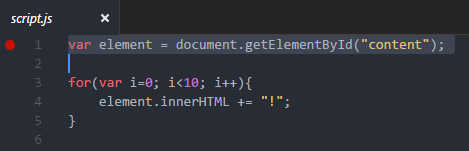
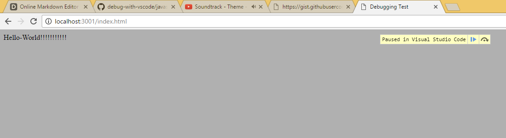

# Debugging Javascript App

This project goal is to show you how to debug a simple javascript application with vscode. You are going to need to configure your **launch.json**, generate valid sourcemaps and run your app in a Chrome browser with remote debugger. So lets get started!

## Installation

Download the whole repository or clone it by executing the following git command:

```
git clone https://github.com/miguelcjalmeida/debug-with-vscode
```

After that, open the repository in your terminal and execute the following commands:

```
cd javascript
npm install
npm run dev
```

All dependencies should get installed and a webserver should be running. So open the javascript folder as your base directory in your vscode and click on the extensions view (ctrl+shift+X). Type **"Debugger for Chrome"** and install it. This extension is required to debug in your chrome with vscode.

## Running chrome in debug mode
You must launch Chrome with remote debugging enabled in order for the extension to attach to it. Follow the steps below depending on your operational system.

##### Windows

Right click the Chrome shortcut, and select properties
In the "target" field, append --remote-debugging-port=9222

Or in a command prompt, execute <path to chrome>/chrome.exe --remote-debugging-port=9222
##### OS X

In a terminal, execute /Applications/Google\ Chrome.app/Contents/MacOS/Google\ Chrome --remote-debugging-port=9222

##### Linux

In a terminal, launch google-chrome --remote-debugging-port=9222

## Application is runnable, lets see it!

After all the instalations steps, the application should already be runnable in your web server. So please open the following exacly url: http://localhost:3001/index.html.

The application must have printed a "hello world!!!!!!" message in your screen. There is a javascript writing every exclamation mark. I want you to debug this javascript by opening the following file in your vscode: **./app/scripts/script.js** . Put a breakpoint in the first line and go to debug view (ctrl+shift+D).



There is a dropdown menu with the following option selected "Javascript - Attach". Press the play button (ctrl+F5) to start debugging your application. Go to your chrome browser and refresh your application twice, now your browser should get paused because the javascript execution is stopped in your breakpoint.

If the execution is not stopping in your breakpoint try doing the following steps.
* Go to your vscode editor
* click on the pause button in your debug controllers.
* check your Chrome, the screen should get paused.



If your chrome is not paused yet, then you might have forgotten to open your chrome in debug mode. Go to "running chrome in debug mode" section above.

Now that you finally have successfully debugged your code, did you feel like there is some kind of magic behind it? No? So lets pound a bit about it. There is a *gulpfile.js* configured to always build your application whenever you make a change in your javascript. Gulp gets all the files inside **./app** folder, then uglify and copy them to the distribution folder **./dist**. So your chrome is running the files in your **./dist** directory while you are putting the breakpoint in the files of **./app/** directory.

So lets check how the magic is done by looking into the next configuration sections.

## Configuring launch.json

Open your .vscode/launch.json and check its configuration:

```
{
    "version": "0.2.0",
    "configurations": [
        {
            "name": "Javascript - Attach",
            "type": "chrome",
            "request": "attach",
            "port": 9222,
            "url": "http://localhost:3001/index.html",
            "webRoot": "${workspaceRoot}/dist/",
            "sourceMaps": true
        }
    ]
}
```
Notice that there are some few properties that must be properly set. So here it is a short explanation for each one.

* **name** - Choose any name you want.
* **type** - Must be "chrome"
* **request** - Must be "attach" to attach to your chrome that is running with remote debugger.
* **port** - Set to 9222 because chrome remote debugger was set up to run with this same port number.
* **url** - This is the exactly url you use to access your page. Vscode will check which chrome tab is running the given url to connect for debugging.
* **webRoot** - the path to the base directory of your distribution files
* **sourceMaps** - enables vscode to look for sourcemap files in the "webRoot' directory.

## Source maps, the catch!

Source maps makes the connection between the distribution code with the original source code. So a *.map* file is a json containing some properties and usually a lot of content in it. You should pay attention to two very important properties called **"sources"** and **"sourceRoot"**.

The **"sources"** property is a array of file names that this sourcemap is referencing. The **"sourceRoot"** property is a relative path from your distribution code up to your app code. So lets go ahead and check the **./dist/scripts.js.map**.

```
{
    "version":3,
    "sources":["scripts/script.js"],
    "names":["element","document","getElementById","i","innerHTML"],
    "mappings":"AAEA,IAAI,GAFAA,SAAUC,SAASC,eAAe,WAE9BC,EAAE,EAAGA,EAAE,GAAIA,IACfH,QAAQI,WAAa",
    "file":"script.js",
    "sourcesContent":[null],
    "sourceRoot":"../../app/"
}
```

Notice that there is a **"source"** property with value *"scripts/script.js"* and its *"sourceRoot"* property tells that the original source code is two folders up, inside app folder. So this makes possible for vscode to debug your original code while executing your distributed code.

Gulp is generating the sourcemap through the following task:

```
gulp.task('build-javascript', ['build-javascript-html'], () => {
    return gulp.src(['./javascript/**/*.js', '!./javascript/dist'])
        .pipe(sourcemaps.init())
        .pipe(uglify())
        .pipe(sourcemaps.write('.', {sourceRoot: '../'})) // <--- source root from distribution folder to app folder
        .pipe(gulp.dest('./javascript/dist/'))
})
```

Notice that in this task we only had to inform to **"sourceRoot"** property a relative path from the distribution directory up to the app directory. Gulp will properly generate sourcemaps with correct "sourceRoot" even if they are in nesting folders.

## Tutorial completed

Now that you have debug your **app/scripts.js** try creating more **js** files and debugging them just to make sure you have mastered this tutorial! Also don't forget to add your new javascripts to your **app/index.html**.

## Contributing

Feel free to contribute with more examples, maintaining readme.md files, or anything else!

1. **Fork it!**
2. Create your feature branch: `git checkout -b my-new-feature`
3. Commit your changes: `git commit -am 'Add some feature'`
4. Push to the branch: `git push origin my-new-feature`
5. Submit a pull request o/

[//]: # (references that made possible writing this application example and its readme.md file)

   [dill]: <https://github.com/joemccann/dillinger>
   [readme template]: <https://gist.githubusercontent.com/zenorocha/4526327/raw/5b41e986a8ac81cf97f53cb2015f07b21c0795b9/README.md>
   [Microsoft vscode debug tutorial]: https://code.visualstudio.com/Docs/editor/debugging
   [Debugger for chrome]: https://github.com/Microsoft/vscode-chrome-debug/blob/master/README.md
